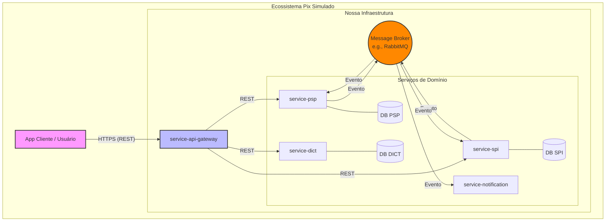
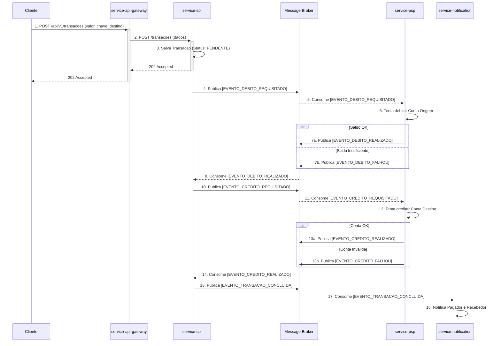

# Projeto de Simulação do Ecossistema Pix

[](https://github.com/actions)
[](https://opensource.org/licenses/MIT)

Este repositório contém o código-fonte de um sistema distribuído que simula o fluxo completo de transações Pix, desde o cadastro de chaves até a liquidação financeira. O projeto é construído usando uma arquitetura de microsserviços em Java com Spring Boot.

> **Importante:** Este é um projeto de simulação para fins educacionais e de portfólio.  
> Ele **não** se conecta ao SPI (Sistema de Pagamentos Instantâneos) real do Banco Central do Brasil.

---

## 🧩 1. Visão Geral da Arquitetura

Para simular a complexidade e a separação de responsabilidades do Pix real, adotamos uma arquitetura de microsserviços.  
Cada serviço é um "especialista" em um domínio de negócio (ex: chaves, contas, transações).

💡 **Analogia simples:**  
Pense em um restaurante.
- O `service-api-gateway` é o **maître**, que recebe os pedidos.
- O `service-psp` é a **cozinha**, onde as operações financeiras acontecem.
- O `service-dict` é o **livro de reservas**, que sabe onde cada cliente está.
- O `service-spi` é o **gerente**, que garante que o pedido certo vá da cozinha para a mesa certa.

Eles não gritam uns com os outros — usam o `Message Broker` como um **sistema de pedidos organizado e assíncrono**.



---

## 🗂️ 2. Estrutura do Monorepo

Organizamos o projeto em um **monorepo** para facilitar o gerenciamento de dependências e a visualização do sistema como um todo.

```
/
├── .github/                 # Workflows de CI/CD (GitHub Actions)
├── docs/                    # Documentação de arquitetura (ADRs, diagramas)
├── services/
│   ├── service-api-gateway/   # O portão de entrada (Gateway)
│   ├── service-dict/          # Simula o DICT (Chaves Pix)
│   ├── service-notification/  # Serviço de Notificações
│   ├── service-psp/           # Simula os Bancos (Contas e Saldos)
│   └── service-spi/           # Simula o SPI (Transações)
├── docker-compose.yml       # Orquestra todos os serviços e infra (DBs, Broker)
└── README.md                # Este arquivo
```

---

## ⚙️ 3. Descrição dos Serviços

Cada serviço é um projeto **Spring Boot independente**, com seu próprio banco de dados  
(Princípio **Database-per-Service**).

### 🧭 3.1. service-api-gateway
**Responsabilidade:** Ponto único de entrada para todas as requisições externas.  
Atua como um **porteiro inteligente**.

**Funções:**
- Roteamento de requisições (`/api/v1/chaves/*` → `service-dict`)
- Autenticação e Autorização (tokens JWT)
- Rate Limiting (limitar requisições por usuário)

**Tecnologias:** Spring Cloud Gateway  
**Porta (Local):** `8080`  
**README:** `services/service-api-gateway/README.md`

---

### 💰 3.2. service-psp (Participante do Sistema de Pagamentos)
**Responsabilidade:** Simula um Banco ou Fintech (gestão de contas e saldos).

**Funções:**
- Gerenciar usuários e contas
- Operações de débito e crédito transacionais
- Consultar extratos

**Tecnologias:** Spring Boot, Spring Data JPA, PostgreSQL  
**Porta (Local):** `8081`  
**README:** `services/service-psp/README.md`

---

### 🔑 3.3. service-dict (Diretório de Chaves)
**Responsabilidade:** Simula o DICT do Banco Central.

**Funções:**
- Cadastrar chaves (CPF, E-mail, Celular, Aleatória)
- Garantir unicidade de chaves
- Consultar e remover chaves

**Tecnologias:** Spring Boot, Spring Data JPA, PostgreSQL  
**Porta (Local):** `8082`  
**README:** `services/service-dict/README.md`

---

### ⚡ 3.4. service-spi (Sistema de Pagamentos Instantâneos)
**Responsabilidade:** Simula o SPI.  
É o **maestro** das transações Pix.

**Funções:**
- Receber e orquestrar pagamentos (padrão SAGA)
- Publicar e ouvir eventos (ex: débito, crédito, falha)
- Gerenciar status das transações (PENDENTE, CONCLUÍDA, FALHA)

**Tecnologias:** Spring Boot, Spring Data JPA, Spring AMQP (RabbitMQ), PostgreSQL  
**Porta (Local):** `8083`  
**README:** `services/service-spi/README.md`

---

### 🔔 3.5. service-notification
**Responsabilidade:** Enviar notificações simuladas (logs).

**Funções:**
- Ouvir eventos (`TRANSACAO_CONCLUIDA`, `TRANSACAO_FALHOU`)
- Formatar e "enviar" notificações

**Tecnologias:** Spring Boot, Spring AMQP (RabbitMQ)  
**Porta (Local):** `8084`  
**README:** `services/service-notification/README.md`

---

## 🧰 4. Stack de Ferramentas

| Categoria | Ferramentas |
|------------|--------------|
| Linguagem | **Java 17+** |
| Framework | **Spring Boot 3+** |
| APIs | Spring Web |
| Persistência | Spring Data JPA |
| Mensageria | Spring AMQP / RabbitMQ |
| Gateway | Spring Cloud Gateway |
| Banco de Dados | PostgreSQL |
| Contêinerização | Docker & Docker Compose |
| Build | Maven |

---

## 🔄 5. Fluxo Principal — A SAGA da Transação Pix

Não podemos fazer um débito e crédito na mesma transação (bancos diferentes).  
Por isso usamos o **padrão SAGA (Coreografia)**, baseado em eventos.  
Se algo falhar, a SAGA executa ações de compensação.



---

## 🚀 6. Como Iniciar (Getting Started)

Você pode executar todo o ecossistema localmente usando **Docker Compose**.

### Pré-requisitos
- **Git** — Para clonar o repositório
- **JDK 17+** *(opcional)* — Para compilar manualmente
- **Maven** *(opcional)* — Para builds locais
- **Docker & Docker Compose** — Essenciais para rodar todo o ambiente

### Executando o Projeto com Docker Compose

Clone o repositório:
```bash
git clone <url-do-seu-repositorio>
cd simulador-pix
```

Execute o Docker Compose:
```bash
docker-compose up --build -d
```

Verifique os contêineres:
```bash
docker-compose ps
```

Exemplo de saída esperada:
```
NAME                                STATUS              PORTS
simulador-pix-service-api-gateway   running (healthy)   0.0.0.0:8080->8080/tcp
simulador-pix-service-dict          running (healthy)   8082/tcp
simulador-pix-service-notification  running (healthy)   8084/tcp
simulador-pix-service-psp           running (healthy)   8081/tcp
simulador-pix-service-spi           running (healthy)   8083/tcp
simulador-pix-rabbitmq              running (healthy)   5672/tcp, 15672/tcp
```

### Acessos
- **API Gateway:** [http://localhost:8080](http://localhost:8080)
- **Painel RabbitMQ:** [http://localhost:15672](http://localhost:15672) (login: `guest` / senha: `guest`)

---

## ⚠️ 7. Pontos de Atenção

- **Database-per-Service:**  
  Um serviço **nunca** deve acessar o banco de outro.  
  Comunicação apenas via **APIs** (síncrono) ou **Eventos** (assíncrono).

- **Comunicação:**
    - *Síncrona (REST):* consultas rápidas, ex: Gateway → Dict
    - *Assíncrona (Eventos):* processos de negócio, ex: pagamentos (SPI ↔ PSP)

---

## 📄 8. Licença

Este projeto está licenciado sob a **Licença MIT**.  
Consulte o arquivo [LICENSE](./LICENSE) para mais detalhes.

Criado por **Jusley Souza**